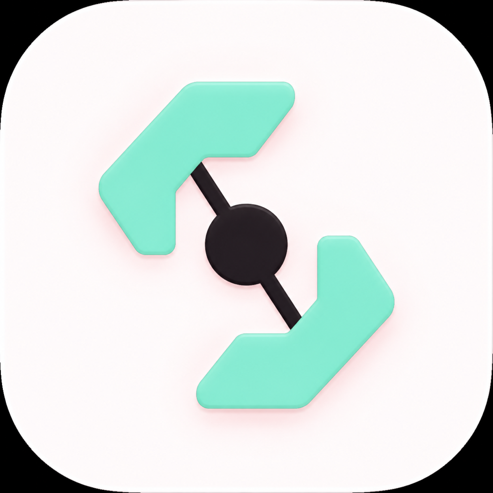

<p align="center">
  
</p>

<h1 align="center">Clash Glass</h1>

<p align="center">
  A lightweight, native macOS client powered by <a href="https://github.com/MetaCubeX/mihomo">Mihomo</a>.
</p>

Clash Glass is written in SwiftUI for macOS. It manages local Mihomo profiles,
proxy groups, routing overrides, connections, logs, system proxy settings, and
TUN state through Mihomo's controller API.

> Clash Glass is an independent community project and is not affiliated with
> MetaCubeX.

## Highlights

- Native macOS interface with responsive Liquid Glass controls
- Direct Mihomo process lifecycle and controller API integration
- Local YAML profile import, validation, selection, rename, and removal
- Rule, Global, and Direct outbound modes
- Per-profile routing overrides
- Proxy latency testing, live traffic, connection, and log views
- Menu bar quick access
- Light, dark, and live system appearance modes
- English, Simplified Chinese, Traditional Chinese, Japanese, French, Russian,
  Spanish, and Portuguese interface support
- Signed in-app updates powered by Sparkle
- No bundled subscriptions, sample profiles, or telemetry

## Requirements

- macOS 15 or later
- Xcode 16 or a Swift 6 toolchain

## Build

Download the current Mihomo core and Geo data:

```bash
./script/bootstrap.sh
```

Build and launch the app:

```bash
./script/build_and_run.sh
```

The downloaded runtime files stay local and are excluded from Git.

## Test

```bash
swift test
```

## Publish an update

Updates are published from version tags, not ordinary commits. Create and push
a semantic version tag:

```bash
git tag v0.2.0
git push origin v0.2.0
```

The Release workflow builds a DMG, signs it with Sparkle's EdDSA key, generates
the appcast, and uploads both files to a GitHub Release. Installed copies show
an **Update** capsule beside the macOS window controls when a newer release is
available.

The `SPARKLE_PRIVATE_KEY` repository secret must remain configured. Application
preferences stay in `~/Library/Preferences`, while profiles and runtime data
stay in `~/Library/Application Support/Clash Glass`; replacing the app bundle
does not remove either location.

## Project layout

- `Sources/ClashGlass` — macOS application entry point and menu bar host
- `Sources/ClashGlassCore` — UI, state, Mihomo services, and repositories
- `Tests/ClashGlassTests` — unit and integration-oriented tests
- `script` — runtime bootstrap and local app bundle scripts

## License

Clash Glass is available under the MIT License. Mihomo and Geo data retain
their respective upstream licenses; see [NOTICE.md](NOTICE.md).
